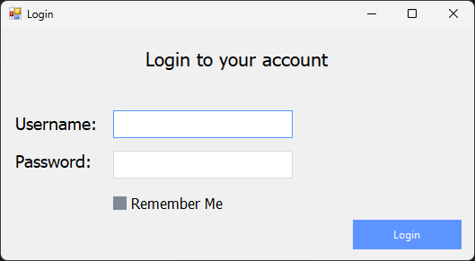
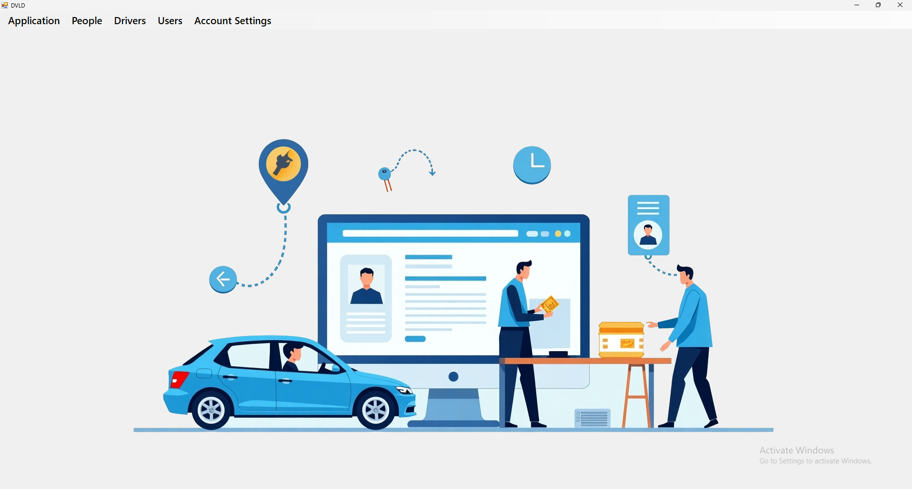
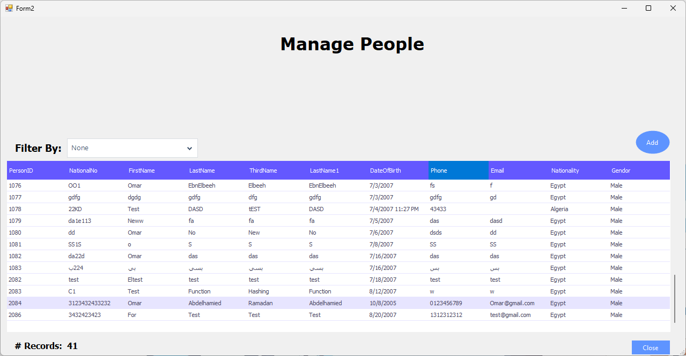
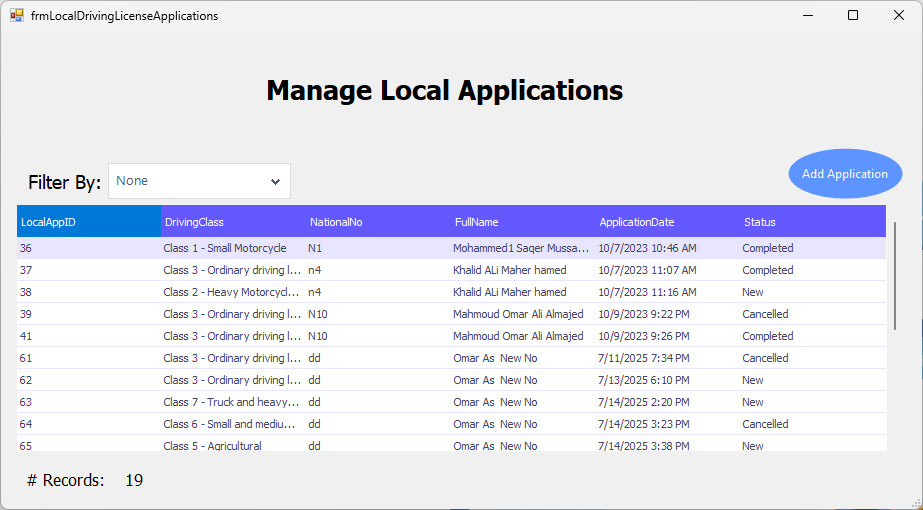
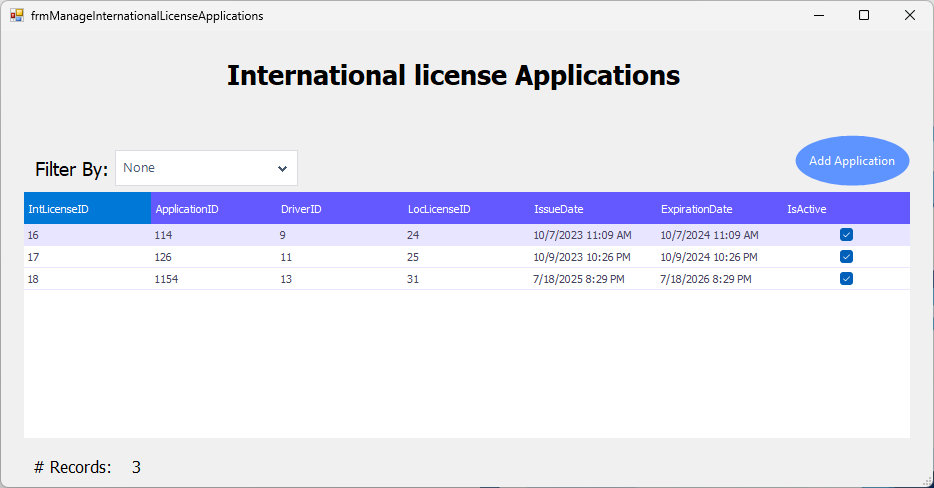

# 🚗 DVLD - Driving License Management System

A comprehensive desktop application for managing driving licenses, applications, tests, and related administrative tasks. Built with C# WinForms and following a three-tier architecture pattern.

## 📋 Table of Contents

- [Features](#-features)
- [Screenshots](#-screenshots)
- [Technology Stack](#-technology-stack)
- [Architecture](#-architecture)
- [Installation](#-installation)
- [Usage](#-usage)
- [Project Structure](#-project-structure)
- [Contact](#-contact)

## ✨ Features

### 🔐 User Management
- **Secure User Authentication & Authorization**
- **User Registration and Management**
- **Advanced Password Security with SHA256 Hashing**
- **"Remember Me" Functionality using Windows Registry**
- **Role-based Access Control**
- **User Session Management**

### 👥 People Management
- **Comprehensive Person Registration and Management**
- **Personal Information Management**
- **Contact Details Management**
- **Person Search and Filtering**

### 🚘 Driver Management
- **Driver Registration and Profile Management**
- **Driver Information Management**
- **Driver Status Tracking**
- **Driver History and Records**

### 📝 Application Management
- **Local Driving License Applications**
- **International License Applications**
- **Application Status Tracking and Workflow**
- **Application Types Management**
- **Application History and Audit Trail**

### 🎯 Test Management
- **Advanced Test Scheduling System**
- **Test Appointments Management**
- **Test Types Management**
- **Test Results Tracking and Recording**
- **Test History and Performance Analytics**

### 🪪 License Management
- **License Issuance with Multiple Classes**
- **License Renewal Processing**
- **License Replacement for Lost/Damaged Licenses**
- **Comprehensive License History Tracking**
- **Detained License Management System**
- **License Release Processing**

### 🔍 Administrative Features
- **Application Types Management**
- **Test Types Management**
- **Countries Management**
- **License Classes Management**
- **System Configuration Management**

## 📸 Screenshots

### Login Screen
Secure login interface with user authentication  


### Main Dashboard
Main application screen with navigation menu  


### People Management
Comprehensive people registration and management interface  


### License Applications
Local and international license application management  
  



### Detained Licenses, License Issuance, Test Management and Other Features
In Video Demo


## 🛠 Technology Stack

- **Framework**: .NET Framework 4.7.2
- **Language**: C#
- **UI Framework**: Windows Forms (WinForms)
- **UI Components**: Guna.UI2 WinForms (Modern UI Library)
- **Architecture**: Three-Tier Architecture
- **Database**: SQL Server
- **Data Access**: ADO.NET
- **Security**: SHA256 Password Hashing
- **Windows Registry**: For "Remember Me" functionality
- **IDE**: Visual Studio


## 🏗 Architecture

The project follows a **Three-Tier Architecture** pattern:

```
┌─────────────────────────────────────┐
│        Presentation Layer           │
│         (WinForms UI)               │
├─────────────────────────────────────┤
│         Business Layer              │
│      (Business Logic)               │
├─────────────────────────────────────┤
│       Data Access Layer             │
│      (Database Access)              │
└─────────────────────────────────────┘
```

### Layer Responsibilities:

- **Presentation Layer**: User interface, form handling, user interactions
- **Business Layer**: Business logic, data validation, application rules
- **Data Access Layer**: Database operations, data persistence

## 🚀 Installation

### Step 1: Clone the Repository
```bash
git clone git clone https://github.com/OmarAbouelkheirr/Driving-Vehicles-and-Licenses-Department-System
cd DVLD
```

### Step 2: Database Setup
1. Open **SQL Server Management Studio**
2. Connect to your SQL Server instance
3. **Import the Database**:
   - Right-click on **Databases** in Object Explorer
   - Select **Attach...**
   - Click **Add** and browse to the `Database/` folder in the project
   - Select the `DVLD.mdf` file
   - Click **OK** to attach the database
4. The database will be imported with all tables, data, and stored procedures ready to use

### Step 3: Configure Connection String
1. Open `DVLD/App.config`
2. Update the connection string with your database details:
```xml
<connectionStrings>
    <add name="DVLDConnectionString" 
         connectionString="Data Source=YOUR_SERVER;Initial Catalog=DVLD;Integrated Security=True"
         providerName="System.Data.SqlClient" />
</connectionStrings>
```

### Step 4: Build and Run
1. Open `DVLD.sln` in Visual Studio
2. Restore NuGet packages (if prompted)
3. Build the solution (`Ctrl + Shift + B`)
4. Run the application (`F5`)


## 💻 Usage

### 🔐 Security Features
- **SHA256 Password Hashing**: All passwords are securely hashed using SHA256 algorithm
- **Remember Me Functionality**: Login credentials are securely stored in Windows Registry
- **Session Management**: Automatic session handling and logout functionality
- **User Authentication**: Multi-level user authentication and authorization

### 🚀 First Time Setup
1. **Launch the application**
2. **Login with default credentials** (check documentation for default admin account)
3. **Configure application settings** through the admin panel
4. **Add initial data** (countries, license classes, test types, etc.)

### 📋 Daily Operations
1. **User Login**: Authenticate with your credentials
2. **Navigate**: Use the main menu to access different modules
3. **Manage Applications**: Process license applications
4. **Schedule Tests**: Arrange driving tests for applicants
5. **Issue Licenses**: Generate and issue driving licenses
6. **Track History**: Monitor application and license history

### 🔄 Key Workflows

#### License Application Process
1. **Register new person** in the system
2. **Create driving license application** with required details
3. **Schedule required tests** (vision, theory, practical)
4. **Process test results** and record outcomes
5. **Issue license** upon successful completion of all tests

#### License Renewal Process
1. **Search for existing license** using license number or person details
2. **Verify eligibility** for renewal (check expiration, violations, etc.)
3. **Process renewal application** with updated information
4. **Issue renewed license** with new expiration date

#### Detained License Management
1. **Detain license** with reason and fine amount
2. **Track detained licenses** in the system
3. **Process release applications** when conditions are met
4. **Release license** with proper documentation

#### Test Management Workflow
1. **Schedule test appointments** for applicants
2. **Manage test sessions** and examiner assignments
3. **Record test results** (pass/fail with notes)
4. **Generate test reports** and certificates

## 📁 Project Structure

```
DVLD/
├── BusinessLayer/           # Business logic layer
│   ├── clsApplication.cs
│   ├── clsPerson.cs
│   ├── clsLicense.cs
│   └── ...
├── DataAccessLayer/         # Data access layer
│   ├── clsApplicationsData.cs
│   ├── clsPersonData.cs
│   ├── clsLicenseData.cs
│   └── ...
├── DVLD/                   # Presentation layer (Main application)
│   ├── Login/              # Authentication forms
│   ├── People/             # People management forms
│   ├── Applications/       # Application management forms
│   ├── Tests/              # Test management forms
│   ├── License/            # License management forms
│   ├── Users/              # User management forms
│   ├── Controlrs/          # Custom user controls
│   └── ...
└── packages/               # NuGet packages
```


## 📞 Contact

### Developer
- **LinkedIn**: [Omar Abouelkheir](https://www.linkedin.com/in/omar-abouelkhier-eg/)
- **GitHub**: [Omar Abouelkheir](https://github.com/OmarAbouelkheirr/)

---

## 🙏 Acknowledgments

- **Guna.UI2** for the beautiful UI components
- **Microsoft** for the .NET Framework
- **SQL Server** for the database management system

---

**Note**: This is a comprehensive driving license management system designed for government agencies, driving schools, or any organization that needs to manage driving licenses and related processes efficiently.

⭐ **Star this repository if you find it helpful!**
